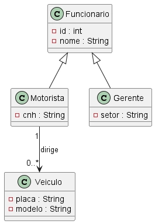

> Postman com os testes
    https://gabrieloliveira280807-4372426.postman.co/workspace/Ricardo-Gabriel-Vianna-de-Olive~35927df0-14bc-4a14-8392-b87bed7a5408/collection/53283468-d06e637a-9f3a-4d7d-8c7f-297ef8dc2465?action=share&source=copy-link&creator=53283468




Uma locadora de veículos deseja desenvolver um sistema para controlar seus motoristas e veículos.

No sistema existem dois tipos de funcionários: **Motorista** e **Gerente**. Ambos herdam características da classe `Funcionario`.

Cada motorista pode dirigir vários veículos, mas cada veículo possui apenas um motorista responsável.

Crie um diagrama de classes UML contendo:

- Herança entre `Funcionario`, `Motorista` e `Gerente`;
- Associação entre `Motorista` e `Veiculo`;
- Multiplicidades nas associações.

Também crie os endpoints REST para:

- Salvar;
- Listar todos;
- Remover.

Exemplo:

```
POST /motoristas
GET /motoristas
PUT /motoristas/{id}

GET /gerentes
DELETE /gerentes/{id}

POST /veiculos
GET /veiculos

```