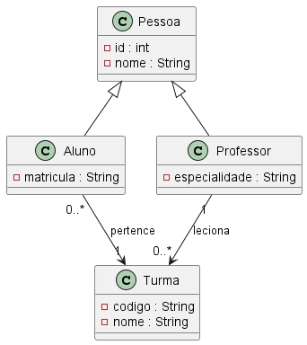

# Prova Teste Java/Spring 2:

Crie uma aplicação para conforme o diagrama abaixo



Uma escola deseja desenvolver um sistema para gerenciar pessoas e turmas.

No sistema existem dois tipos de pessoas: **Aluno** e **Professor**. Ambos herdam características da classe `Pessoa`.

Cada aluno pertence a uma turma, e um professor pode lecionar para várias turmas.

Crie um diagrama de classes UML contendo:

- Herança entre `Pessoa`, `Aluno` e `Professor`;
- Associação entre `Aluno` e `Turma`;
- Associação entre `Professor` e `Turma`.

Também crie os endpoints REST para:

```
POST /alunos
GET /alunos
DELETE /alunos/{id}

POST /professores

POST /turmas
GET /turmas
```